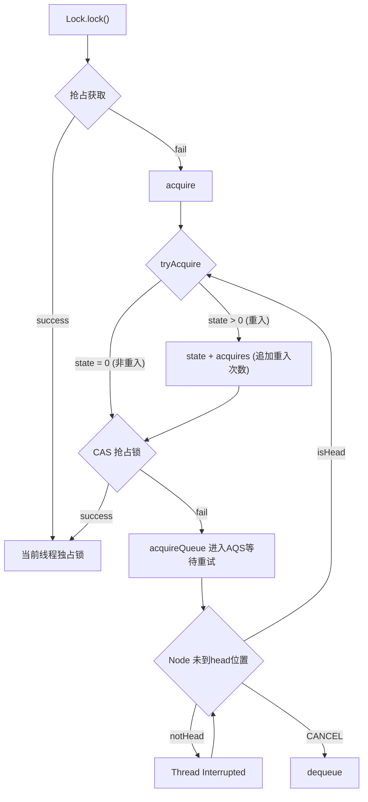
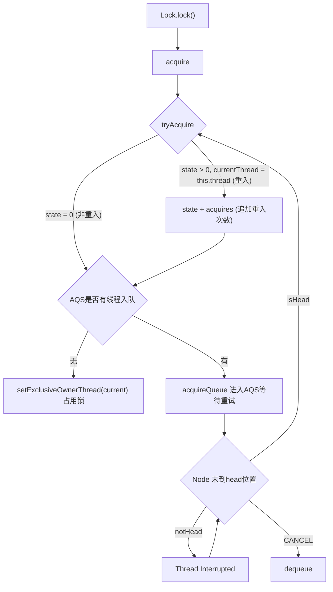
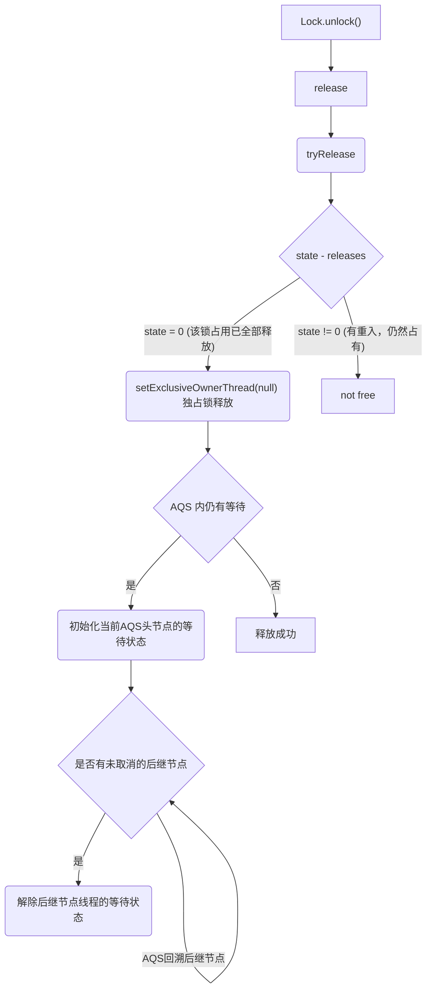

AQS (AbstractQueuedSynchronizer) 是JDK 中的一个抽象类，旨在

>提供一个基于FIFO等待队列的阻塞锁，以及相关同步器（例如： 信号量，事件等等）的实现框架。适用于那些用一个原子整数值来代表状态的 sychronizer。


<!--more-->

在AQS 的源码中，我们可以看到它通过多个原子值来维持同步队列的规则


```java
    /**
     * Head of the wait queue, lazily initialized.  Except for
     * initialization, it is modified only via method setHead.  Note:
     * If head exists, its waitStatus is guaranteed not to be
     * CANCELLED.
     */
    private transient volatile Node head;

    /**
     * Tail of the wait queue, lazily initialized.  Modified only via
     * method enq to add new wait node.
     */
    private transient volatile Node tail;

    /**
     * The synchronization state.
     */
    private volatile int state;
```

AQS 队列本身维护 AQS 内的节点 (`Node`)的头节点 `head` 和尾节点 `tail`，这两个都是原子的节点引用，请记住AQS 是一个队列，说明 head 节点是当前在占用锁的线程，而获取不到锁而加入等待的线程则会被`enq` 到AQS的末尾tail 节点。

state 是当前锁的申请 (acquire) 次数，一般0是未获取的状态，而非0的状态意味有线程占用了锁。

如果锁支持重入，即一个锁被获取了多次那么state的值会大于1。同理当释放锁的时候，所有获取锁的线程必须都释放 (release) 资源，直到state变成0，锁资源才算完全地被释放了。

另外从父类 `AbstractOwnableSynchronizer` 继承而来的 `exclusiveOwnerThread` 表示独占模式下的当前占用线程，这并不是一个原子值，JDK也不建议用volatile 或 同步的模式来修改这个值。


## 共享和独占

AQS 支持独占 (exclusive) 和共享 (shared) 的形式：
* **独占模式：** 例如互斥锁，线程间不能共享同一个锁。
* **共享模式：** 共享锁 (aka 读锁)，可以使得多个线程共享同一个锁


## ReentrantLock

可重入锁获取锁逻辑：

**非公平锁获取：**



**公平锁获取：**



非公平锁和公平锁实现上的区别在于，非公平锁获取锁是以一种抢占式的方式。

在调用 `Lock.lock()` 的第一步就会尝试去占用锁，如果失败了，还会在 `tryAcquire` 这一步中再次尝试抢占锁，如果还失败了，才会加入AQS队列。

而公平锁会在所有获取锁的地方都会判断是否有线程在AQS中等待，有则加入AQS队列，否则占用锁。

公平锁相比非公平锁有更多的上下文切换和可能的自旋，所以非公平锁的性能要比公平锁更好，但也会导致一些线程一直无法获取到锁（线程饥饿）的现象。

**锁释放：**



## Semaphore


***参考***

---

- [1]https://www.cnblogs.com/takumicx/p/9402021.html "ReentrantLock 源码解析"

