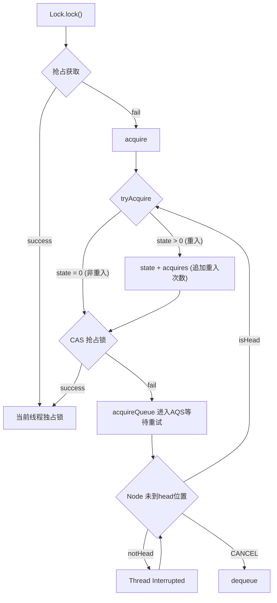
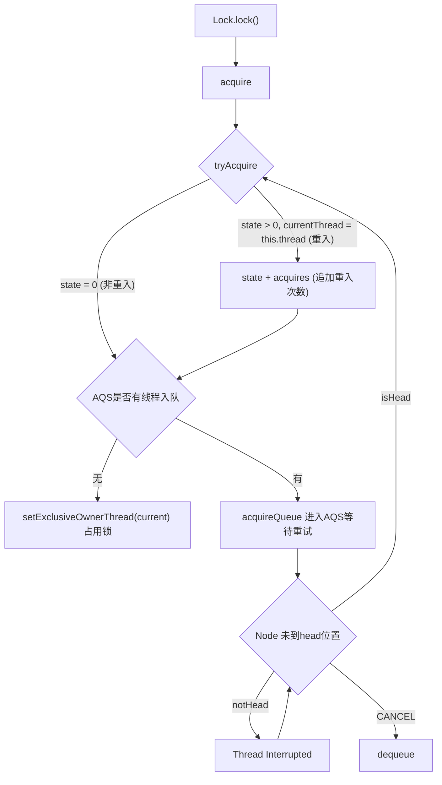
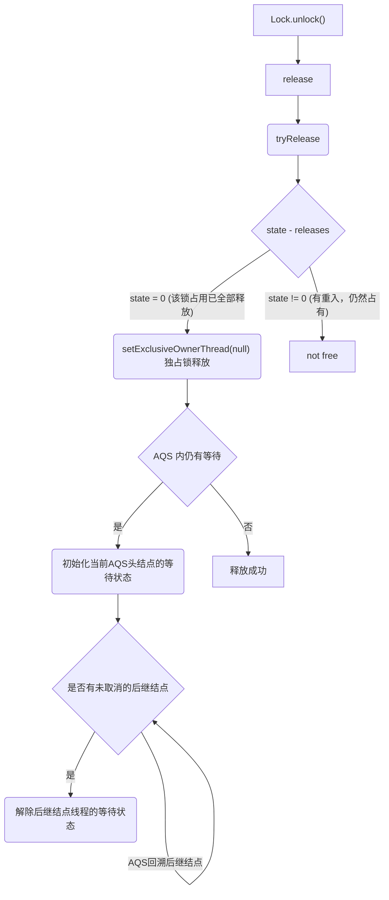

AQS (AbstractQueuedSynchronizer) 是JDK 中的一个抽象类，旨在

>提供一个基于FIFO等待队列的阻塞锁，以及相关同步器（例如： 信号量，事件等等）的实现框架。适用于那些用一个原子整数值来代表状态的 sychronizer。


<!--more-->

在AQS 的源码中，我们可以看到它通过多个原子值来维持同步队列的规则


```java
    /**
     * Head of the wait queue, lazily initialized.  Except for
     * initialization, it is modified only via method setHead.  Note:
     * If head exists, its waitStatus is guaranteed not to be
     * CANCELLED.
     */
    private transient volatile Node head;

    /**
     * Tail of the wait queue, lazily initialized.  Modified only via
     * method enq to add new wait node.
     */
    private transient volatile Node tail;

    /**
     * The synchronization state.
     */
    private volatile int state;
```

AQS 队列本身维护 AQS 内的结点 (`Node`)的头结点 `head` 和尾结点 `tail`，这两个都是原子的结点引用，请记住AQS 是一个队列，说明 head 结点是当前在占用锁的线程，而获取不到锁而加入等待的线程则会被`enq` 到AQS的末尾tail 结点。

state 是当前锁的申请 (acquire) 次数，一般0是未获取的状态，而非0的状态意味有线程占用了锁。

如果锁支持重入，即一个锁被获取了多次那么state的值会大于1。同理当释放锁的时候，所有获取锁的线程必须都释放 (release) 资源，直到state变成0，锁资源才算完全地被释放了。

另外从父类 `AbstractOwnableSynchronizer` 继承而来的 `exclusiveOwnerThread` 表示独占模式下的当前占用线程，这并不是一个原子值，JDK也不建议用volatile 或 同步的模式来修改这个值。

## Node 结点的状态

AQS Node 结点的状态在源码中的定义

```java
    static final class Node {
        /** Marker to indicate a node is waiting in shared mode */
        static final Node SHARED = new Node();
        /** Marker to indicate a node is waiting in exclusive mode */
        static final Node EXCLUSIVE = null;

        /** waitStatus value to indicate thread has cancelled */
        static final int CANCELLED =  1;
        /** waitStatus value to indicate successor's thread needs unparking */
        static final int SIGNAL    = -1;
        /** waitStatus value to indicate thread is waiting on condition */
        static final int CONDITION = -2;
        /**
         * waitStatus value to indicate the next acquireShared should
         * unconditionally propagate
         */
        static final int PROPAGATE = -3;

        /**
         * Status field, taking on only the values:
         *   SIGNAL:     The successor of this node is (or will soon be)
         *               blocked (via park), so the current node must
         *               unpark its successor when it releases or
         *               cancels. To avoid races, acquire methods must
         *               first indicate they need a signal,
         *               then retry the atomic acquire, and then,
         *               on failure, block.
         *   CANCELLED:  This node is cancelled due to timeout or interrupt.
         *               Nodes never leave this state. In particular,
         *               a thread with cancelled node never again blocks.
         *   CONDITION:  This node is currently on a condition queue.
         *               It will not be used as a sync queue node
         *               until transferred, at which time the status
         *               will be set to 0. (Use of this value here has
         *               nothing to do with the other uses of the
         *               field, but simplifies mechanics.)
         *   PROPAGATE:  A releaseShared should be propagated to other
         *               nodes. This is set (for head node only) in
         *               doReleaseShared to ensure propagation
         *               continues, even if other operations have
         *               since intervened.
         *   0:          None of the above
         *
         * The values are arranged numerically to simplify use.
         * Non-negative values mean that a node doesn't need to
         * signal. So, most code doesn't need to check for particular
         * values, just for sign.
         *
         * The field is initialized to 0 for normal sync nodes, and
         * CONDITION for condition nodes.  It is modified using CAS
         * (or when possible, unconditional volatile writes).
         */
        volatile int waitStatus;

```

|状态|值|说明|
|-|-|-|
| 初始化      |  0| AQS结点的初始化状态，相当于无状态 |
|`CANCELLED` |  1| AQS结点已取消等待，这种状态的结点一般会被其后继结点检测到取消状态，然后后继结点会向头结点移动，排在正常等待的结点后面 |
|`SIGNAL`    | -1| 该状态意味着其后继结点已经或准备让自己进入阻塞(park)状态，理解为准备唤醒状态，该前驱结点释放锁的时候，就会通知SIGNAL状态的后驱结点的线程执行 |
|`CONDITION` | -2| 线程基于Condition对象发生了等待，线程的结点进入了相应的队列，当其他线程调用了Condition的signal()方法后，CONDITION状态的结点将从等待队列转移到同步队列中，等待获取同步锁 |
|`PROPAGATE` | -3| 读写锁中，当读锁最开始没有获取到操作权限，得到后会发起一个`doReleaseShared()`动作，内部也是一个循环，当判定后续的结点状态为0时，尝试通过CAS自旋方式将状态修改为这个状态，表示结点可以运行 |


## 共享和独占

AQS 支持独占 (exclusive) 和共享 (shared) 的形式：
* **独占模式：** 例如互斥锁，线程间不能共享同一个锁。
* **共享模式：** 共享锁 (aka 读锁)，可以使得多个线程共享同一个锁


## ReentrantLock

可重入锁获取锁逻辑：

**非公平锁获取：**



**公平锁获取：**



非公平锁和公平锁实现上的区别在于，非公平锁获取锁是以一种抢占式的方式。

在调用 `Lock.lock()` 的第一步就会尝试去占用锁，如果失败了，还会在 `tryAcquire` 这一步中再次尝试抢占锁，如果还失败了，才会加入AQS队列。

而公平锁会在所有获取锁的地方都会判断是否有线程在AQS中等待，有则加入AQS队列，否则占用锁。

公平锁相比非公平锁有更多的上下文切换和可能的自旋，所以非公平锁的性能要比公平锁更好，但也会导致一些线程一直无法获取到锁（线程饥饿）的现象。

**锁释放：**



## Semaphore


***参考***

---

- [1]https://www.cnblogs.com/takumicx/p/9402021.html "ReentrantLock 源码解析"
- [2]http://ifeve.com/java-special-troops-aqs/  "AQS的原理浅析 并发编程网 - ifeve.com"
