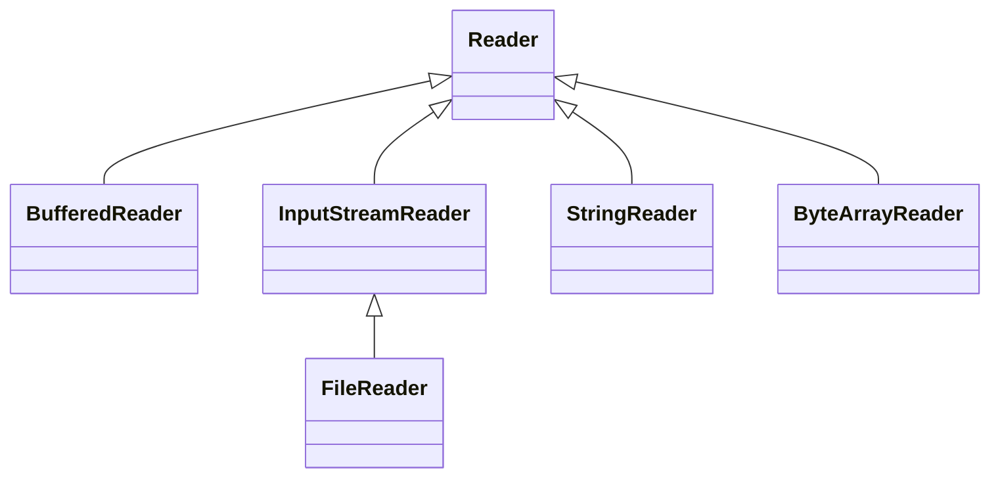
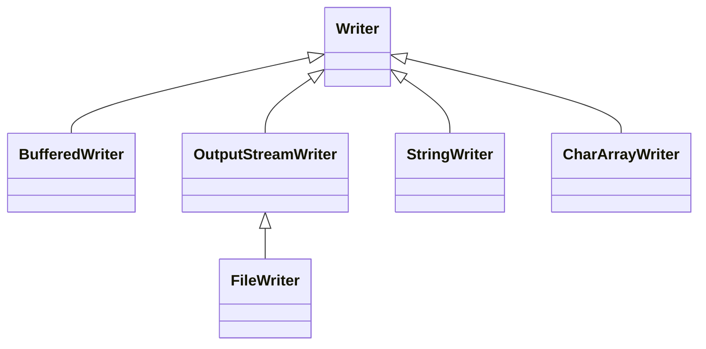
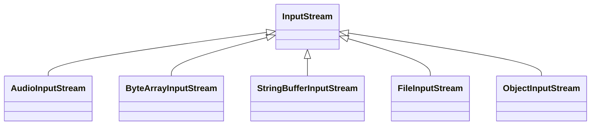
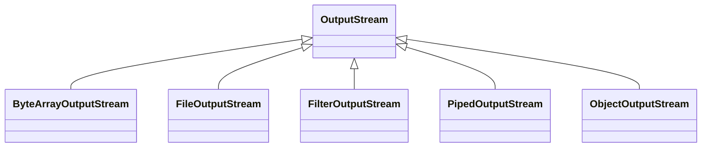

# java io Stream

java 的 IO 模型是面向流(Stream)的一系列API, 采用的是阻塞IO模式

## 流 Stream

面向流说明原本不存在缓冲区，用户需要每次从一个流中逐字节读/写直到完成。且无法进行光标的前后移动操作，这需要事先写入缓冲区，才能完成

Stream 是单向的，一个流只能是读或者写。

基本处理对象抽象为：
    - `InputStream` 输入流
    - `OutputStream`  输出流

概念上分成了两种Stream:

    - __节点流__
    - 节点流意味着从一个特定的地方读取数据，例如文件流就是和文件写入或读取打交道。
    - `FileInputStream` , `FileOutputStream`文件数据源
    - `System.in` 例如键盘输入, `System.out`, `System.err`
    - `FileReader`
    - `ByteArrayOutputStream`
    - __过滤流__
    - 过滤流的数据源一般是现成的节点流或者过滤流。在传来的数据基础上进行特定的操作。又称作“处理流”
    - BufferedReader 缓冲
    - InputStreamReader, OutputStreamReader 转换处理

组合流程示意图：

```
READ: 
[文件] -> 节点流 -> 过滤流 -> 过滤流 -> [数据]

WRITE:
[数据] -> 过滤流 -> 过滤流 -> 节点流 -> [文件]
```

__java IO 基本处理流程：__
1. 创建数据流
2. 查看是否有可读数据（或者是否达到EOF之类的标志)
3. 读取或写入
4. 结束，关闭流。

进一步分化：_等待和就绪，即，系统等待可读和实际读，系统等待可写和实际写_

## 使用例

文件内容：

```
Name: Tim
Age: 25
Email: tim@supermailserver.com
Phone: 1234567890
```

处理代码:

```java
BufferedReader reader = new BufferedReader(new InputStreamReader(input));
String nameLine   = reader.readLine();
String ageLine    = reader.readLine();
String emailLine  = reader.readLine();
String phoneLine  = reader.readLine();
```


## java.io 和 装饰者模式

Decorator装饰者模式使得各种流可以层层嵌套，使得数据处理自由的组合。但因为基于了最基本的接口（InputStream/OutputStream），用户并不会注意到不同的组合有什么区别，即该层对用户是透明的。


## `java.io` package 类关系

### 字符流 

> __`Reader`__ reading character streams. read, finally close

- [Reader](https://docs.oracle.com/javase/8/docs/api/java/io/Reader.html)
    - [BufferedReader](https://docs.oracle.com/javase/8/docs/api/java/io/BufferedReader.html)
    - [CharArrayReader](https://docs.oracle.com/javase/8/docs/api/java/io/CharArrayReader.html)
    - [FilterReader](https://docs.oracle.com/javase/8/docs/api/java/io/FilterReader.html)
    - [InputStreamReader](https://docs.oracle.com/javase/8/docs/api/java/io/InputStreamReader.html) a bridge from byte streams to character streams: It reads bytes and decodes them into characters using a specified charset. 
    - [FileReader](https://docs.oracle.com/javase/8/docs/api/java/io/FileReader.html)
    - [PipedReader](https://docs.oracle.com/javase/8/docs/api/java/io/PipedReader.html)
    - [StringReader](https://docs.oracle.com/javase/8/docs/api/java/io/StringReader.html)
 
 


> __`Writer`__ for writing to character streams, write then flush, finally close.


- [Writer](https://docs.oracle.com/javase/8/docs/api/java/io/Writer.html)
    - [BufferedWriter](https://docs.oracle.com/javase/8/docs/api/java/io/BufferedWriter.html)
    - [CharArrayWriter](https://docs.oracle.com/javase/8/docs/api/java/io/CharArrayWriter.html)
    - [FilterWriter](https://docs.oracle.com/javase/8/docs/api/java/io/FilterWriter.html)
    - [OutputStreamWriter](https://docs.oracle.com/javase/8/docs/api/java/io/OutputStreamWriter.html)
    - [PipedWriter](https://docs.oracle.com/javase/8/docs/api/java/io/PipedWriter.html)
    - [PrintWriter](https://docs.oracle.com/javase/8/docs/api/java/io/PrintWriter.html)
    - [StringWriter](https://docs.oracle.com/javase/8/docs/api/java/io/StringWriter.html)




### 字节流 

> __`InputStream`__ representing an input stream of bytes. subclass must always provide a method that returns the next byte of input.


-  [InputStream](https://docs.oracle.com/javase/8/docs/api/java/io/InputStream.html)
    - [AudioInputStream](https://docs.oracle.com/javase/8/docs/api/javax/sound/sampled/AudioInputStream.html)
    - [ByteArrayInputStream](https://docs.oracle.com/javase/8/docs/api/java/io/ByteArrayInputStream.html)
    - [FileInputStream](https://docs.oracle.com/javase/8/docs/api/java/io/FileInputStream.html)
    - [ObjectInputStream](https://docs.oracle.com/javase/8/docs/api/java/io/ObjectInputStream.html)
    - [StringBufferInputStream](https://docs.oracle.com/javase/8/docs/api/java/io/StringBufferInputStream.html)




> __`OutputStream`__ representing an output stream of bytes. An output stream accepts output bytes and sends them to some sink.


- [OutputStream](https://docs.oracle.com/javase/8/docs/api/java/io/OutputStream.html)
    - [ByteArrayOutputStream](https://docs.oracle.com/javase/8/docs/api/java/io/ByteArrayOutputStream.html)
    - [FileOutputStream](https://docs.oracle.com/javase/8/docs/api/java/io/FileOutputStream.html)
    - [FilterOutputStream](https://docs.oracle.com/javase/8/docs/api/java/io/FilterOutputStream.html)
    - [ObjectOutputStream](https://docs.oracle.com/javase/8/docs/api/java/io/ObjectOutputStream.html)
    - [PipedOutputStream](https://docs.oracle.com/javase/8/docs/api/java/io/PipedOutputStream.html)




